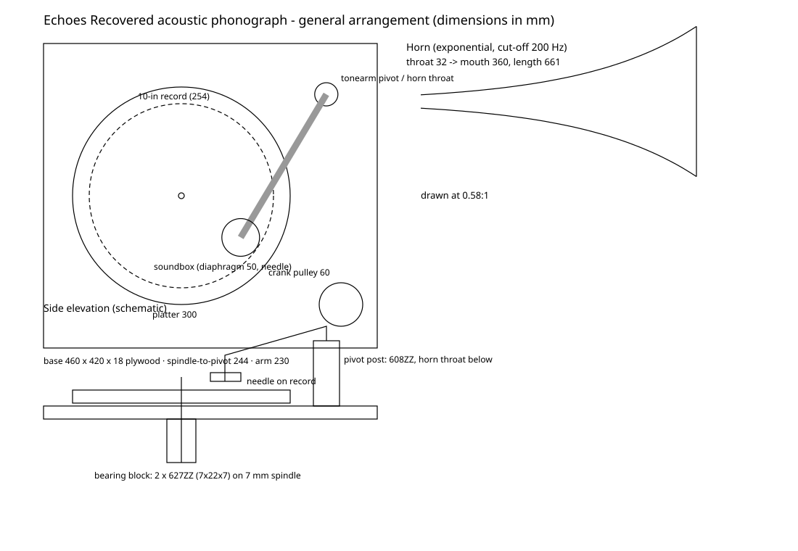

# 手工机械留声机：结构、零件与装配方案

> **状态说明：** 这是一份**设计与装配方案**，尚未做成实物，也没有经过实测。下文所有尺寸都来自 `phonograph/design.py` 的计算，重新运行 `python phonograph/design.py` 可以得到完全相同的数值与 1:1 模板。实物做好后，请把实测结果填进第 8 节的记录表。

这台机器是一台**纯机械、无电子放大**的唱片留声机，设计目标是"能真正播放唱片并能看清原理"，而不是做一个装饰模型。它播放的是 National Jukebox 中那类 **10 英寸、约 78 rpm、横向刻纹（lateral-cut）的虫胶唱片**。

---

## 1. 原理：沟槽里的振动如何重新变成声音

```
 沟槽横向摆动 ──► 唱针 ──► 针杆（杠杆）──► 振膜（活塞）──► 唱臂管道 ──► 指数号角 ──► 空气
 (几十 µm)        钢针     约 3:1 力放大      Ø50 mm 薄片        声音导管          阻抗匹配
```

1. **沟槽（groove）**：acoustic recording 时代，录音号角把声音送到刻录振膜上，刻刀随之**左右摆动**，在旋转的蜡盘上刻出一条横向弯曲的螺旋沟槽。沟槽的横向位移就是"冻结"的声波，幅度只有几十微米。
2. **唱针（needle / stylus）**：钢针插在沟槽里，唱片转动时被沟壁**左右推动**。唱针不"读取"信息，它只是被迫重现当年刻刀的运动轨迹。
3. **针杆（stylus bar）**：唱针夹在一根以刀口为支点的小杠杆上。唱针在支点下方约 30 mm，连接振膜的点在支点上方约 10 mm。于是唱针的**横向**摆动变成振膜中心的**前后**运动：位移缩小到约 1/3，力放大约 3 倍，正好推得动较硬的振膜。
4. **振膜（diaphragm）**：一片直径 50 mm 的薄云母或铝片，四周用橡胶垫圈柔性夹紧。它像活塞一样推动后方的空气，产生声压。振膜越轻越灵敏，但太软会产生共振和失真，这也是当年唱片录音中频带"峰谷不平"的来源之一（数字修复里的 adaptive EQ 正是在补偿这类共振）。
5. **唱臂（tonearm）**：在 acoustic 唱机里，唱臂是一根**空心声音导管**。它一端承托唱头，另一端在转轴处把声音送进号角，同时引导唱头沿弧线从外圈走到内圈。
6. **号角（horn）**：振膜面积小，直接面对空气时效率很低，大部分能量都浪费了。号角把截面从喉部（Ø32 mm）**按指数规律**逐渐放大到口部（Ø360 mm），使振膜"看到"的声学负载与开阔空气相匹配，这就是声学**阻抗匹配**。指数号角的截止频率 `fc = m·c / 4π`；低于 fc 的声音几乎无法有效辐射，所以 acoustic 唱机的低音很弱，这与数字分析中测得的"有效频带约 250–3500 Hz"一致。

**与数字修复部分的对应关系：** 修复代码里的 click 检测针对的是灰尘和划痕对唱针的冲击；hiss 和 surface noise 来自唱针摩擦虫胶颗粒；"有效频带"上下限来自刻录号角和振膜的物理极限；速度和音高问题来自转速不准。亲手做一台机器，就能亲耳听到这些损伤是在哪个环节产生的。

---

## 2. 总体布置



| 子系统 | 关键尺寸（计算值） |
|---|---|
| 底板 | 460 × 420 × 18 mm 桦木多层板 |
| 转盘 | Ø300 × 18 mm MDF，上覆 3 mm 毛毡；主轴 Ø7 mm，2 × 627ZZ 轴承（7×22×7 mm） |
| 转速 | 目标 78.26 rpm（60 Hz 照明下的标准频闪值）/ 77.92 rpm（50 Hz 照明） |
| 传动 | Ø60 mm 手摇皮带轮 → 转盘边缘，比例 5.0 : 1，摇柄约 **15.7 rpm** |
| 唱臂 | 有效长度 230 mm（转轴到针尖）；**转轴到主轴中心 243.9 mm，即 underhang 13.9 mm**；直臂、无偏置角 |
| 循迹误差 | 半径 55–120 mm 范围内最大 **8.1°**（若零悬垂会达到 15.1°） |
| 唱头 | 振膜 Ø50 mm；针杆杠杆比约 3:1；循迹重量 100–130 g |
| 号角 | 指数型，m = 7.327 m⁻¹，截止 200 Hz，喉部 Ø32 → 口部 Ø360 mm，长 661 mm，6 段锥台拼接 |

> 号角口部的理想直径是 546 mm（口部周长等于截止频率的波长）。360 mm 是桌面尺寸上的折中：200 Hz 附近效率会下降，但对 acoustic 唱片的频带已经足够。

---

## 3. 零件清单（BOM）

| # | 零件 | 规格 / 材料 | 数量 | 说明 |
|---|---|---|---|---|
| 1 | 底板 | 18 mm 桦木多层板 460×420 | 1 | 底部加 4 个橡胶脚垫隔振 |
| 2 | 转盘 | 18 mm MDF，切 Ø300 圆 | 1 | 边缘车出 3 mm 半圆槽作皮带槽；可在背面沿外圈用螺丝固定 6–8 个 M10 垫圈增加惯量 |
| 3 | 毛毡 | 3 mm 羊毛毡 Ø295 | 1 | |
| 4 | 主轴 | Ø7 mm 钢棒，长 90 mm | 1 | 顶端倒角；7 mm 比唱片中孔（约 7.3 mm）略小，可缠一圈胶带消除偏心 |
| 5 | 主轴轴承 | 627ZZ（7×22×7） | 2 | 压入 40×40×60 mm 硬木轴承座，上下相距 40 mm |
| 6 | 轮毂 | 7 mm 孔径轴套 / 法兰联轴器 | 1 | 把转盘固定到主轴上 |
| 7 | 摇柄轴 | Ø8 mm 钢棒 + 608ZZ ×2 | 1 套 | Ø60 mm 木或打印皮带轮，外接 L 形摇柄（臂长约 80 mm） |
| 8 | 皮带 | Ø3 mm 橡胶 O 圈或圆皮带，周长按实测 | 1 | 张紧后不打滑即可 |
| 9 | 唱臂管 | 铝管 Ø20×1 mm，长约 200 mm | 1 | 加 90° 弯头接唱头（PVC 弯头或 3D 打印） |
| 10 | 唱臂转轴座 | 608ZZ + Ø22 硬木 / 打印立柱 | 1 | 竖直轴承让唱臂水平摆动；水平铰链（M3 螺丝）允许抬臂 |
| 11 | 振膜 | 0.1 mm 铝箔片 / 0.15–0.2 mm 云母片 / 0.25 mm PET 片，Ø50 | 各 1 | 三种都做，对比音色（见第 7 节实验） |
| 12 | 垫圈 | Ø50 硅胶 O 圈或开口硅胶管 | 2 | 夹在振膜两侧，柔性固定 |
| 13 | 唱头壳 | Ø62×14 mm，木车削或 3D 打印，中心出声孔 Ø18 | 1 | 背面接唱臂弯头 |
| 14 | 针杆 | 黄铜条 1.5×3×45 mm | 1 | 在距下端 30 mm 处做刀口支点 |
| 15 | 针夹 | M3 紧定螺丝 + 黄铜管 | 1 | 夹持钢唱针 |
| 16 | 连杆 | Ø0.3 mm 钢丝 / 粗钓鱼线 | 1 | 针杆上端 → 振膜中心，用一滴虫胶或 CA 胶固定 |
| 17 | 唱针 | 传统钢唱针（loud / medium） | 若干 | **每面唱片换一根** |
| 18 | 号角 | 0.5 mm 卡纸 / 海报纸板，2–3 层叠合 | 6 段 | 按 `build/horn_template_1..6.svg` 1:1 打印裁切 |
| 19 | 号角支架 | 木条 + 弯管卡箍 | 1 套 | 让号角重量不压在唱臂上 |
| 20 | 平衡配重 | 螺母或铅块 20–60 g | 1 | 装在唱臂转轴后方，调节循迹重量 |
| 21 | 频闪盘 | `build/strobe_50hz.svg` 或 `strobe_60hz.svg` | 1 | 按当地电网频率选择 |
| 22 | 测试唱片 | **可以牺牲的** 10 英寸虫胶 78 转唱片 | 2–3 | 二手市场的常见曲目即可 |

工具：线锯 / 带锯、手电钻、锉刀、砂纸、木工胶、CA 胶、热熔胶、虫胶漆（可选）、游标卡尺、厨房秤（量循迹重量）。

---

## 4. 号角的尺寸与纸样

`build/horn_profile.csv` 给出每 16.5 mm 的半径；号角由 6 段锥台近似，每段半径比相同（约 1.5 倍）：

| 段 | 喉端半径 | 口端半径 | 斜长 | 展开内半径 R1 | 展开外半径 R2 | 展开角 |
|---|---|---|---|---|---|---|
| 1 | 16.0 | 24.0 | 110.4 | 222.2 | 332.6 | 25.9° |
| 2 | 24.0 | 35.9 | 110.7 | 222.9 | 333.6 | 38.7° |
| 3 | 35.9 | 53.7 | 111.5 | 224.5 | 336.0 | 57.5° |
| 4 | 53.7 | 80.3 | 113.3 | 228.0 | 341.3 | 84.7° |
| 5 | 80.3 | 120.2 | 117.1 | 235.7 | 352.8 | 122.7° |
| 6 | 120.2 | 180.0 | 125.3 | 252.1 | 377.4 | 171.7° |

（单位 mm。每段纸样都另加 12 mm 粘接舌，SVG 中用虚线标出折线。第 6 段纸样宽 774 mm，需要 A1 尺寸的纸板，或者拆成两半拼接。）

**制作要点：** 打印前先用模板上的 50 mm 校验线确认打印比例是 100%。每段用 2–3 层纸板交错叠合粘牢，内壁刷一层虫胶漆或稀释白胶，让内壁光滑坚硬，减少吸声和纸板自身振动。各段之间用宽胶带在外侧缠绕连接，接缝处内壁要齐平。

---

## 5. 装配步骤

### 第 0 步：30 分钟原理验证（强烈建议先做）
把 A4 纸卷成锥形，针尖穿过锥顶后用胶带固定，然后轻轻搭在一张**可以牺牲的**旧唱片上，用手匀速转动唱片，就能听到微弱的音乐。这一步只是为了亲耳确认"沟槽 → 振动 → 声音"这条链路，之后再做正式结构。

### 第 1 步：底板与转盘
1. 在底板上距左边 190 mm、距前边 270 mm 处钻孔，安装轴承座（两只 627ZZ 压入）。
2. 转盘切圆后，用钻床或简易圆规夹具找正中心；边缘用圆锉加工出皮带槽。
3. 用轮毂把转盘装到主轴上，手转检查：边缘端面跳动小于 1 mm、不卡滞、惯性滑行超过 20 秒。
4. 贴毛毡，把主轴顶端倒角。

### 第 2 步：手摇传动
1. 在底板右后角安装摇柄轴（2 × 608ZZ），皮带轮与转盘边缘同高。
2. 套上 O 圈皮带；摇柄约每 4 秒转一圈（15.7 rpm），转盘即约 78 rpm。
3. 把频闪盘放到转盘上，在普通白炽灯或荧光灯下（**许多 LED 灯没有频闪，看不出效果**），调整摇速直到黑条"静止"。练习匀速摇动；转盘越重，转速越稳。

### 第 3 步：唱头（soundbox）
1. 唱头壳内径做成 52 mm 的台阶，用来放"垫圈—振膜—垫圈"。前盖用 3 颗 M3 螺丝压紧，以振膜不松动、又没有被压死为准。
2. 针杆支点：在唱头壳下沿固定两颗 M2 螺丝，螺丝尖锉成锥形，夹住针杆两侧的小锥孔，形成可转动的刀口；转动应顺滑、没有间隙。
3. 针杆下端装针夹（距支点 30 mm），上端（距支点 10 mm）用钢丝连到振膜正中心，粘一滴 CA 胶。连杆要短而直，并且不能把振膜拉变形。
4. 检查：用手指轻推针尖左右移动，从出声孔应能看到振膜中心前后运动。

### 第 4 步：唱臂与号角
1. 转轴立柱中心距主轴中心 **243.9 mm**，位于主轴右后方，使唱针轨迹从外圈（半径 120 mm）扫到内圈（55 mm）。
2. 唱臂管长度要保证"转轴中心到针尖"为 **230 mm**；唱头通过 90° 弯头接在唱臂前端，唱针竖直略向前倾（约 60°）。
3. 号角喉部（Ø32 mm）接在转轴处的出口上；号角自身重量由独立支架承担，唱臂只负责摆动。
4. 用配重把**针尖处的重量调到 100–130 g**（用厨房秤测量）。太轻会跳槽，太重会加速磨损唱片。

### 第 5 步：试音与调整
1. 换上新钢针，放下唱臂，摇到转速稳定后开始听。
2. 如果有"嗡嗡"或"啪啦"的共振：检查垫圈是否压得太紧，连杆是否松动，号角各段接缝是否漏气。
3. 循迹误差最大约 8°，听感上内圈失真会略大，这在直臂 acoustic 机器上是正常现象。

---

## 6. 安全与唱片保护
* 钢唱针和 100 g 以上的循迹重量会**明显磨损唱片**。只播放你自己所有、**可以牺牲的**虫胶 78 转唱片；**绝对不要**用它播放黑胶（LP / 45 转）或有收藏价值的唱片。
* 虫胶唱片很脆，摔落即碎，碎片锋利。
* 每面换一根新针；用过的钢针集中收纳。
* 锯切、钻孔时佩戴护目镜。

---

## 7. 动手实验建议（把实体与数字修复连起来）
1. **振膜材料对比：** 用铝、云母、PET 三种振膜各录一段同一唱片的播放（手机放在号角口 30 cm 处），然后用本项目的分析代码比较三种振膜的"有效频带"和长时平均频谱：
   `python -c "import soundfile as sf; from restoration import analysis; x,sr=sf.read('my_take.wav'); print(analysis.analyze(x.mean(1) if x.ndim>1 else x, sr))"`
2. **有号角 vs 无号角：** 取下号角再录一次，对比声压与低频，直观感受阻抗匹配的作用。
3. **转速误差：** 故意摇快或摇慢 5%，再用 `analysis.tuning_and_wow` 测音高偏移（5% 约等于 84 cents）。这正是数字修复里"speed correction"需要判断的问题。

---

## 8. 实测记录表（做好实物后填写）

| 项目 | 设计值 | 实测值 | 备注 |
|---|---|---|---|
| 转盘空转滑行时间 | > 20 s | | |
| 频闪"静止"时的转速 | 78.26 / 77.92 rpm | | |
| 针尖循迹重量 | 100–130 g | | |
| 转轴—主轴距离 | 243.9 mm | | |
| 唱臂有效长度 | 230 mm | | |
| 号角长度 / 口径 | 661 / 360 mm | | |
| 可播放唱片 | 10 英寸 78 rpm 虫胶 | | |

## 9. 文件
* `design.py`：全部尺寸计算（号角、纸样、频闪盘、唱臂几何、总图）
* `build/drawing.svg`：总体布置图（俯视与侧视）
* `build/horn_template_1..6.svg`：1:1 号角纸样
* `build/horn_profile.csv`、`build/horn_segments.csv`：号角数据
* `build/strobe_50hz.svg`、`build/strobe_60hz.svg`：频闪盘（按 100% 打印）
* `build/tonearm.txt`：唱臂几何与循迹误差表
